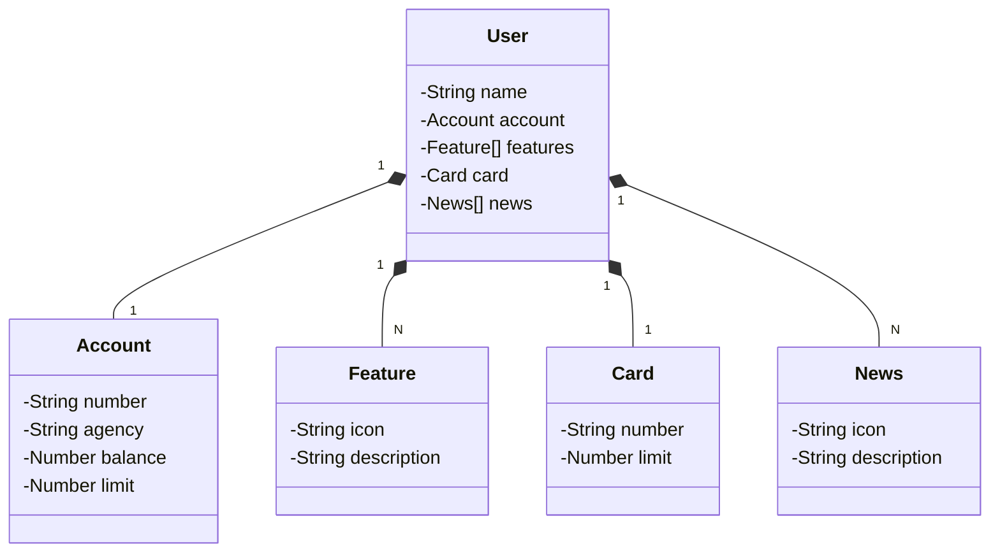

# Santander Dev Week - 2023 | DIO
Por: @falvorj - Desafio final: Java RESTful API criada para a Santander Dev Week.
[GitHub do projeto](https://github.com/digitalinnovationone/santander-dev-week-2023-api)

## 1 - Principais Tecnologias: Crianção e importação do Projeto - [Spring Initializr](https://start.spring.io/)
* Java 17: Utilizaremos a versão LTS mais recente do Java para tirar vantagem das últimas inovações que essa linguagem robusta e amplamente utilizada oferece;
* Spring Boot 3: Trabalharemos com a mais nova versão do Spring Boot, que maximiza a produtividade do desenvolvedor por meio de sua poderosa premissa de autoconfiguração;
* Spring Data JPA: Exploraremos como essa ferramenta pode simplificar nossa camada de acesso aos dados, facilitando a integração com bancos de dados SQL;
*OpenAPI (Swagger): Vamos criar uma documentação de API eficaz e fácil de entender usando a OpenAPI (Swagger), perfeitamente alinhada com a alta produtividade que o Spring Boot oferece;
* Railway: facilita o deploy e monitoramento de nossas soluções na nuvem, além de oferecer diversos bancos de dados como serviço e pipelines de CI/CD.

## 2 - Versionamento no GitHub
## 3 - Abstração Inicial do Domínio no Figma - [Link do Figma](https://www.figma.com/file/0ZsjwjsYlYd3timxqMWlbj/SANTANDER---Projeto-Web%2FMobile?type=design&node-id=1421%3A432&mode=design&t=6dPQuerScEQH0zAn-1)
O Figma foi utilizado para a abstração do domínio desta API, sendo útil na análise e projeto da solução.
* Utilizando o [JSON Editor On-line](https://jsoneditoronline.org/#left=local.zecori&right=local.puvomo) para começar a montar uma estrutura e moldar de acordo ao entendimento.

## 4 Diagrama de Classes com ChatGPT e Mermaid
* Com JSON aprimorado utilizou o [ChatGPT](https://chat.openai.com/) para montar o Diagrama de Classes, solicitando fidelidade ao JSON passado e uasando a sintaxe [Mermaid](https://mermaid.js.org/). Segue abaixo diagrama:
### Diagrama de Classes

## Mapeamento Objeto Relacional(ORM)
* Criar na IDE todas as classes com atributos privados e realizar o encapsulamento(domain/model);
* Colocar o @Entity(nome = "tb.user");
* Realizar todo o mapeamento nos atributos;
